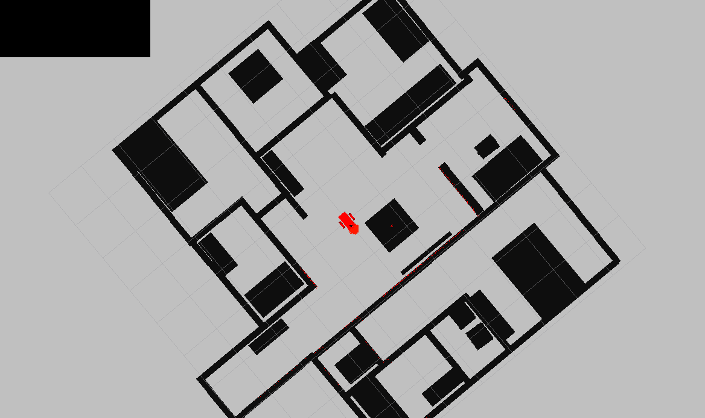
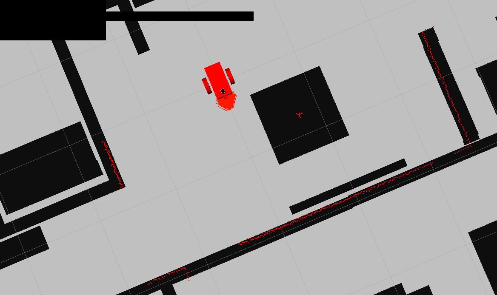
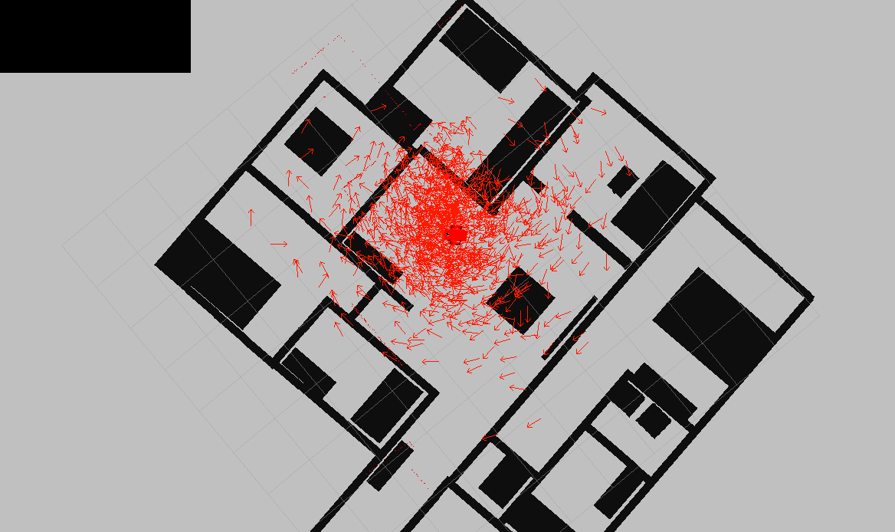
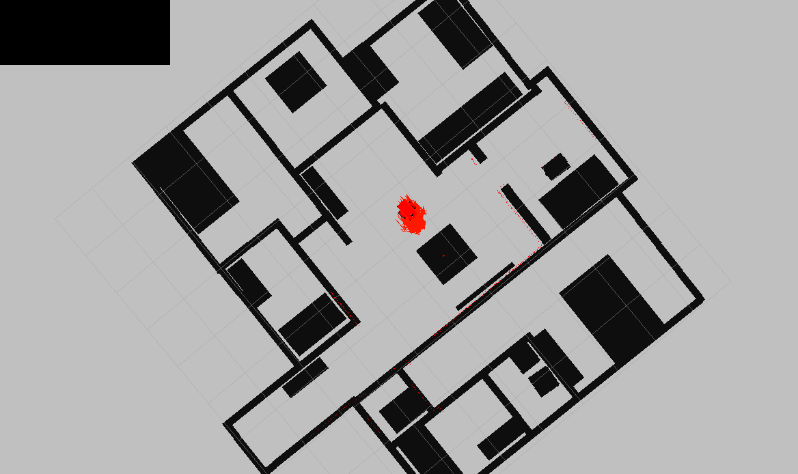

# Where am I?
In this project, I use the robot and world model that was created in [Go Chase it](https://github.com/schandrachary/Robotics/tree/go_chase_it) project. There is no need to chase a ball here, so I removed the `ball_chaser` node. Below is an animation showing how quickly particles recover upon kidnapping. 


This is a localization project and I attempt to determine the pose of the robot using Monte Carlo Localization algorithm. More details on the working of Monte Carlo Localization can be found in [MCL Lab](https://github.com/schandrachary/Robotics/tree/mcl_lab) where I go in depth of particle filter algorithm implementaion. The goal of the project is to:

1. Use the [map server](http://wiki.ros.org/map_server) package to generate a map of the robot world
2. Use the [amcl](http://wiki.ros.org/amcl) package which implements adaptive Monte Carlo localization approach to track the pose of the robot
3. Use the [move base](http://wiki.ros.org/move_base) package which implements global navigation task to attempt to reach a goal in the given world with its mobile base. 

If you clone this repo, you don't have to go through the setup instructions as all it is already performed and saved in the included launch file. You can directly skip to Launch and Test sections. 

## Setup Instructions

### PGM Map creator

#### Install dependencies
We need `libignition-math2-dev` and `protobuf-compiler` to compile the map creator:

- `sudo apt-get install libignition-math2-dev protobuf-compiler`

#### Build the package
- `cd /home/workspace/catkin_ws/`
- `catkin_make`

#### Add and edit the world file
Copy the Gazebo world you created to the world folder

- `cp <YOUR GAZEBO WORLD FILE> src/pgm_map_creator/world/<YOUR GAZEBO WORLD FILE>`
Insert the map creator plugin to your map file. Open the map file using the editor of your choice. Add the following tag towards the end of the file, but just before </world> tag:

`<plugin filename="libcollision_map_creator.so" name="collision_map_creator"/>`

#### Create the PGM Map
Open a terminal, run gzerver with the map file:

- `gzserver src/pgm_map_creator/world/<YOUR GAZEBO WORLD FILE>`

Open another terminal, launch the request_publisher node

- `roslaunch pgm_map_creator request_publisher.launch`

Wait for the plugin to generate map. It will be located in the map folder of the pgm_map_creator! Open it to do a quick check of the map. If the map is cropped, you might want to adjust the parameters in `launch/request_publisher.launch`, namely the `x` and `y` values, which defines the size of the map:

```
  <arg name="xmin" default="-15" />
  <arg name="xmax" default="15" />
  <arg name="ymin" default="-15" />
  <arg name="ymax" default="15" />
  <arg name="scan_height" default="5" />
  <arg name="resolution" default="0.01" />
```

#### Edit the map
The map is an image, which means you could edit it using image processing softwares like gimp in Linux. If you have found the map not accurate due to the models, feel free to edit the pgm file directly!

#### Add the map to your package
Move the map to the `maps` folder
```
cd /home/workspace/catkin_ws/
cp src/pgm_map_creator/maps/<YOUR MAP NAME>  src/<YOUR PACKAGE NAME>/maps/<YOUR MAP NAME>
```

Create a `yaml` file providing [metadata about the map](http://wiki.ros.org/map_server#YAML_format). Create a `yaml` file next to the map:
```
cd src/<YOUR PACKAGE NAME>/src/maps
touch <YOUR MAP NAME>.yaml
```

Open the yaml file and add the following lines to it:
```
image: <YOUR MAP NAME>
resolution: 0.01
origin: [-15.0, -15.0, 0.0]
occupied_thresh: 0.65
free_thresh: 0.196
negate: 0
```

Note that the origin of the map should correspond to your map's size. For example, the default map size is 30 by 30, so the origin will be [-15, -15, 0], i.e. half the size of the map.

### AMCL launch file
Create a `launch` file for AMCLL node in the `launch` directory of the package:
```
$ cd /home/workspace/catkin_ws/src/<YOUR PACKAGE NAME>/launch/
$ vi amcl.launch # nano, gedit
```

1. Add `map_server` node:

&nbsp;&nbsp;&nbsp;&nbsp; `<arg name="map_file" default="$(find <YOUR PACKAGE NAME>)/maps/<YOUR MAP NAME>.yaml"/>`

&nbsp;&nbsp;&nbsp;&nbsp; Then, add the `map_server` node, which utilizes the argument you created just now:

&nbsp;&nbsp;&nbsp;&nbsp; `<node name="map_server" pkg="map_server" type="map_server" args="$(arg map_file)" />`

2. Add `amcl` node:
```
<!-- AMCL Node -->
  <node name="amcl" pkg="amcl" type="amcl" output="screen">
    <remap from="scan" to="/scan"/>
    <param name="odom_frame_id" value="odom"/>
    <param name="odom_model_type" value="diff-corrected"/>
    <param name="base_frame_id" value="robot_footprint"/>
    <param name="global_frame_id" value="map"/>

    <!-- Define initial pose here -->
    <param name="initial_pose_x" value="0"/>
    <param name="initial_pose_y" value="0"/>
    <param name="initial_pose_a" value="-1.5707"/>
    <param name="initial_cov_xx" value="0.0005"/>
    <param name="initial_cov_yy" value="0.0005"/>
    <param name="initial_cov_aa" value="0.0005"/>

    <!-- Movement -->
    <param name="update_min_d" value="0.05"/>
    <param name="update_min_a" value="0.1"/>

    <!-- Define particle size -->	
    <param name="min_particles" value="100"/>
    <param name="max_particles" value="1000"/>

    <!-- Laser parameters -->	
    <param name="laser_min_range" value="0.005"/>
    <param name="laser_max_range" value="30.0"/>
    <param name="laser_max_beams" value="50"/>

    <!-- Odometry parameters -->
    <param name="odom_model_type" value="diff-corrected"/>
    <param name="odom_alpha1" value="0.05"/>	
    <param name="odom_alpha2" value="0.05"/>
    <param name="odom_alpha3" value="0.05"/>
    <param name="odom_alpha4" value="0.05"/>
  </node>
```

3. Add `move_base` node:
&nbsp;&nbsp;&nbsp;&nbsp; First download the config files from Udaicty S3 bucket:
```
wget https://s3-us-west-1.amazonaws.com/udacity-robotics/Resource/where_am_i/config.zip
unzip config.zip
rm config.zip
```
&nbsp;&nbsp;&nbsp;&nbsp; And add the parameters to `amcl.launch`
```
<!-- Move Base -->
  <node name="move_base" pkg="move_base" type="move_base" respawn="false" output="screen">
    <remap from="scan" to="/scan"/>
    <param name="base_global_planner" value="navfn/NavfnROS" />
    <param name="base_local_planner" value="base_local_planner/TrajectoryPlannerROS"/>
    
    <rosparam file="$(find my_robot)/config/costmap_common_params.yaml" command="load" ns="global_costmap" />
    <rosparam file="$(find my_robot)/config/costmap_common_params.yaml" command="load" ns="local_costmap" />
    <rosparam file="$(find my_robot)/config/local_costmap_params.yaml" command="load" />
    <rosparam file="$(find my_robot)/config/global_costmap_params.yaml" command="load" />
    <rosparam file="$(find my_robot)/config/base_local_planner_params.yaml" command="load" />
  </node>
```

4. Add `teleop` package:

&nbsp;&nbsp;&nbsp;&nbsp; Clone the ros-teleop package to your src folder:

```
cd /home/workspace/catkin_ws/src
git clone https://github.com/ros-teleop/teleop_twist_keyboard
```
&nbsp;&nbsp;&nbsp;&nbsp; Build the package and source the setup script:
```
cd ..
catkin_make
source devel/setup.bash
```
&nbsp;&nbsp;&nbsp;&nbsp; Now you could run the teleop script as is described in the README file:

``` 
rosrun teleop_twist_keyboard teleop_twist_keyboard.py
```

## Launch instructions
So far we have the robot, the map, the localization and navigation nodes. Launch all of them using the launch file:
```
$ cd /home/workspace/catkin_ws/
$ roslaunch my_robot world.launch
```
This should launch the gazebo and RViz window. The launch file is configured to load the RViz, so you should be able to see all the signals when it's loaded. RViz will load the map, position the robot in the map at its initial pose (0,0,-1.5707). Gazebo will load the world and the robot model. Make sure the Lidar returns correctly match the map. 




Here's a closer look for Lidar returns:


In a new terminal, launch the `amcl` launch file:
```
$ roslaunch my_robot amcl.launch
```

## Testing
Now you can test the Adaptive Monte Carlo Localization algorithm by moving the robot around in the world and wait for the particles to converge to the Robot's pose. 

#### Option 1: Send 2D Navigation Goal
Click the 2D Nav Goal button in the toolbar of RViz, then click and drag on the map to send the goal to the robot. It will start moving and localize itself in the process.

#### Option 2: Use `teleop` node
Open another terminal and launch the teleop script:

`rosrun teleop_twist_keyboard teleop_twist_keyboard.py`

#### Kidnappin Test:
Move the location of the robot on Gazebo to a new location. When it is first move, you will notice that the robot doens't have a great idea of where it is located



Use the teleop node and move the robot using the keyboard. You will notice just after a few instances of moving the robot, the particles converge very quickly



