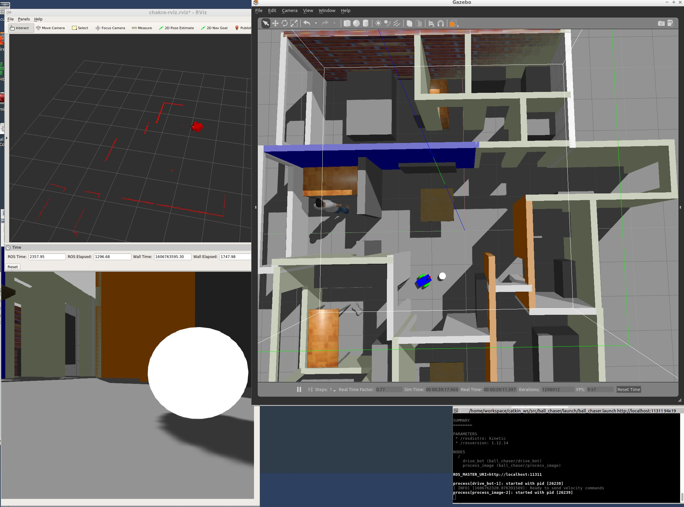

# Go Chaset It
In this project, I house my newly created robot in the world that was built in [build my world](https://github.com/schandrachary/Robotics/tree/robot_world) project.
This robot was has a camera and a lidar on it. The objective of this project is two fold:
1. Subscribe to the camera images and process them to detect a white ball. If found, determine its location
2. Send control commands to the robot to drive closer to the ball


### Directory structure

```
src                                # Go Chase It Project
|-- my_robot                       # my_robot package
│   ├── launch                     # launch folder for launch files
│   │   ├── robot_description.launch
│   │   ├── world.launch
│   ├── meshes                     # meshes folder for sensors
│   │   ├── hokuyo.dae
│   ├── urdf                       # urdf folder for xarco files
│   │   ├── my_robot.gazebo
│   │   ├── my_robot.xacro
│   ├── world                      # world folder for world files
│   │   ├── chakraWorld.world
│   ├── CMakeLists.txt             # compiler instructions
│   ├── package.xml                # package info
├── ball_chaser                    # ball_chaser package
│   ├── launch                     # launch folder for launch files
│   │   ├── ball_chaser.launch
│   ├── src                        # source folder for C++ scripts
│   │   ├── drive_bot.cpp
│   │   ├── process_images.cpp
│   ├── srv                        # service folder for ROS services
│   │   ├── DriveToTarget.srv
│   ├── CMakeLists.txt             # compiler instructions
│   ├── package.xml                # package info
└──

```

### Steps to launch the simulation

#### Step 1 Update and upgrade the Workspace image
```sh
$ sudo apt-get update
$ sudo apt-get upgrade -y
```

#### Step 2 Clone the  folder in /home/workspace/
```sh
$ cd /home/workspace/
$ git clone https://github.com/schandrachary/Robotics myrobot
$ git checkout -b go_chase_it origin/go_chase_it
```

#### Step 3 Compile the code
```sh
$ cd /home/workspace/myrobot/
$ mkdir build
$ cd build/
$ cmake ../
$ make
```

#### Step 4 Run the launch files  
- Launch the my_robot package which launches the robot with its world
```sh
$ cd /home/workspace/myrobot/
$ roslaunch my_robot world.launch
```

- Launch the ball_chaser package which launches the vision processing and controls node
```sh
$ cd /home/workspace/myrobot/
$ roslaunch ball_chaser ball_chaser.launch
```

#### Step 5 (optional)
- You can optionally view the video stream on rqt_image_view node:
`$ rosrun rqt_image_view rqt_image_view`

- Alternatively, you can also load the 
[RViz config](https://github.com/schandrachary/Robotics/blob/go_chase_it/src/chakra-rviz.rviz) (located in this repo for your convenience) on RViz window and that will load the robot, camera and lidar. 

### Output
You will see `my_robot` robot housed in chakra-world, the name of the robot's world. You will the white ball on the north west corner of the robot's initial location. 
Drag the ball and place it infront of the robot, in the camera's field of view. The robot should go after the ball. Note that the robot will stop if it gets too 
close to the ball, so make sure to place it a small distance away from the robot. Here's a picture of the layout:




