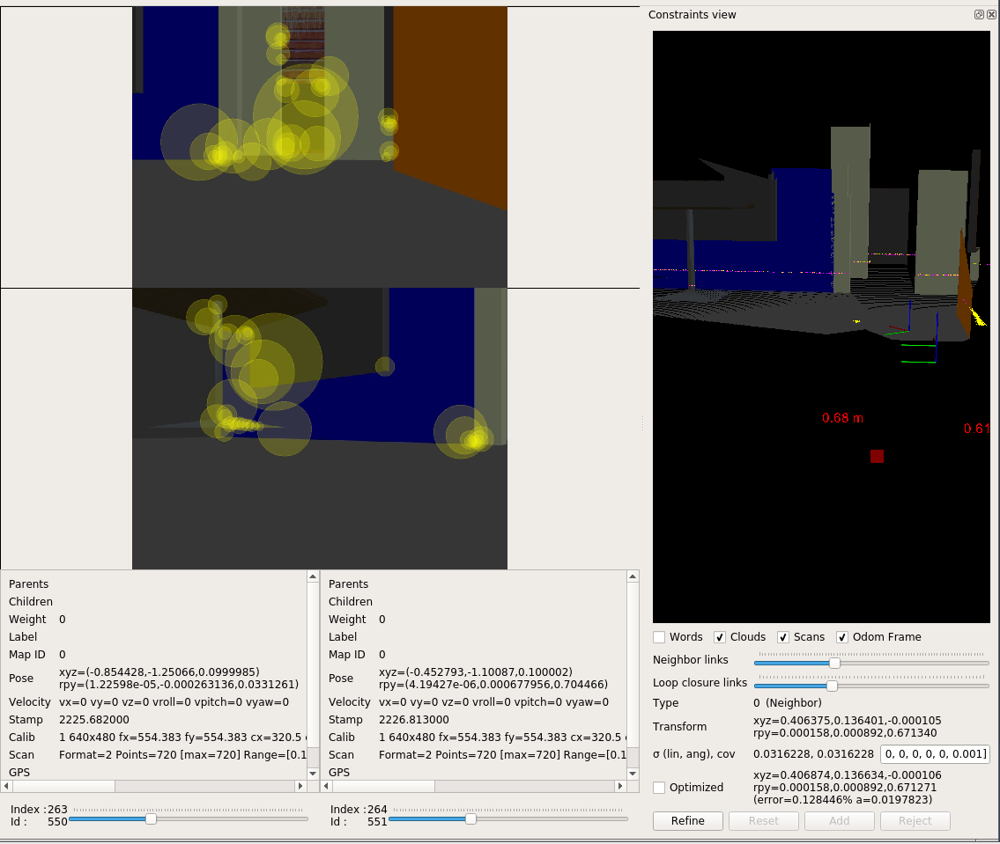

# Map My World!

In this project, I use RTAB-Map (Real-Time Appearance-Based Mapping) package from ROS to create a 2D occupancy grid and 3D octomap from the simulated environment in Gazebo. RTAB-Map is a popular solution for SLAM to develop robots that can map environments in 3D. RTAB-Map has good speed and memory management, and it provides custom developed tools for information analysis. This package is a ROS wrapper of RTAB-Map, a RGB-D SLAM approach based on global loop closure detector with real-time constraints. Below is an animation showing 2D occupancy grid and 3D octomap being generated in real-time as the robot traverses in its environment. 


### Prerequisites

1. ROS-Kinetic, Gazebo on Linux
2. CMake and g++
3. Install `rtabmap-ros` package: `$ sudo apt-get install ros-kinetic-rtabmap-ros`

### Launch Instructions

1. Clone the repo inside of `catkin_ws` directory and initialize catkin workspace:
```
$ mkdir catkin_ws && cd catkin_ws
$ git clone https://github.com/schandrachary/Robotics/tree/map_my_world.git
$ catkin_make
```
2. Launch Gazebo world and RViz, spawn the robot in the environment:
```
$ source devel/setup.bash
$ roslaunch my_robot world.launch
```

2. Open another terminal and launch `teleop` node:
```
$ source devel/setup.bash
$ rosrun teleop_twist_keyboard teleop_twist_keyboard.py
```

3. Open another terminal and launch mapping node:
```
$ source devel/setup.bash
$ roslaunch my_robot mapping.launch
```

After launching all the nodes, executing `rqt_graph` should produce a graph with all active nodes and topics like this:


### Mapping

Navigating the robot in the environment creates a map that will be stored in `/home/workspace/catkin_ws/src` as a database file. Kill the mapping node and launch
`rtabmap-databaseviewer`
```
$ rtabmap-databaseviewer /home/workspace/catkin_ws/src/rtabmap.db
```
- Choose view->Constraint View
- Choose view-> Graph View

The `rtabmap-databaseviewer` is a great tool for exploring database after the generating the map. This allows us to check loop closures, generate 3D maps for viewing, rextract images, check feature mapping rich zones, and much more!

Below is the 2D grid map in all of its updated iterations and the path of the robot


This tool also lets us scrub through all the images to see all of the features from our detection algorithm. These features are in yellow. The pink color indicates where two images have features in common and this information is being used to create neighboring links and loop closures. Below image depicts the features detected in an image



Below images shows how links were created between successive images. Notice the lines(links) connecting features from one image to another. These will eventually be used for loop closures


